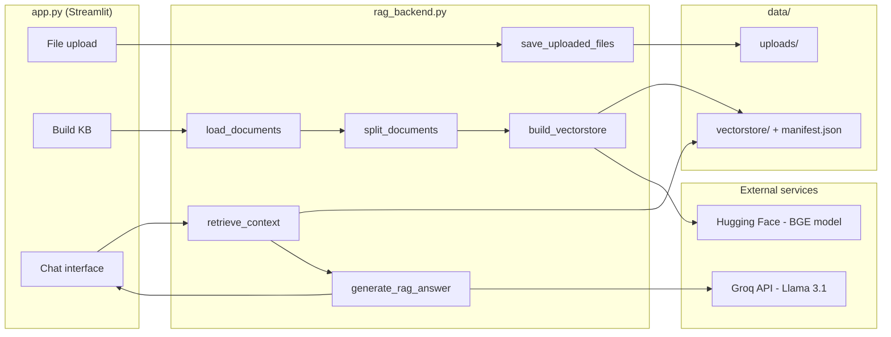

# Enterprise RAG Assistant — Complete Project Summary

## What it is

An **Enterprise RAG Assistant**: a local-first document Q&A app. Users upload PDF, DOCX, or TXT files, build a semantic search index, then chat with an AI that answers **only from those documents** and cites the passages it used.

Built for a hackathon demo, but structured like a small production app: backend pipeline separated from UI, persisted index, source citations, and document management.

---

## Architecture



Two-layer design:

| Layer | File | Role |
|-------|------|------|
| **UI** | `app.py` (~507 lines) | Streamlit chat, sidebar, styling, session state |
| **Pipeline** | `rag_backend.py` (~582 lines) | Full RAG logic, indexing, retrieval, generation |

Data lives under `data/` (gitignored):

- `data/uploads/` — raw uploaded files
- `data/vectorstore/` — FAISS index + `manifest.json` tracking indexed files

---

## Tech stack

| Component | Choice | Why |
|-----------|--------|-----|
| **UI** | Streamlit | Fast to build, chat-native widgets |
| **Orchestration** | LangChain 0.3 | Document loaders, text splitting, FAISS integration |
| **Embeddings** | `BAAI/bge-small-en-v1.5` via `langchain-huggingface` | Local, free, retrieval-tuned, 384-dim |
| **Vector store** | FAISS (CPU) | Fast similarity search, persists to disk |
| **LLM** | `llama-3.1-8b-instant` via Groq | Fast inference, needs only `GROQ_API_KEY` |
| **Parsing** | PyPDF, docx2txt, TextLoader | PDF / DOCX / TXT support |
| **Secrets** | `python-dotenv` + `.env` | API key kept out of code |
| **Tests** | pytest | 4 unit tests on core helpers |

---

## User flow

1. **Upload** — PDF, DOCX, or TXT via sidebar (multi-file)
2. **Build Knowledge Base** — parse → chunk (800 chars, 150 overlap) → embed → FAISS index
3. **Ask questions** — chat retrieves top-4 chunks, sends them to Groq, returns a grounded answer
4. **Review sources** — expandable citations with file name, page (for PDFs), and excerpt
5. **Manage files** — remove files with ✕; rebuild index after changes

---

## RAG pipeline (backend detail)

### Ingestion

- Files saved to disk (Streamlit uploads are ephemeral)
- Unsupported files are **skipped with warnings** (no crash)
- Chunks preserve metadata (`source`, `page`) for citations

### Indexing (smart rebuild)

`build_knowledge_base()` uses a **manifest** (`data/vectorstore/manifest.json`):

| Scenario | Behavior |
|----------|----------|
| Nothing changed | Skip rebuild |
| New files only | Incremental merge into existing FAISS index |
| File removed or edited | Full rebuild |

### Retrieval

- Query prefixed with BGE instruction string for better search
- Top-4 chunks by similarity
- Chunks above distance threshold `1.15` are dropped as irrelevant

### Generation

- Strict system prompt: answer only from context, cite `[1]`/`[2]`, decline if missing
- Temperature `0.2` for factual answers
- `answer_question()` returns `answer`, `sources`, `grounded`, and `no_index`

---

## UI highlights

- ChatGPT-style layout (Inter font, indigo accent, centered chat column)
- Status steps during indexing and answering
- Sidebar shows document count, chunk count, index status
- HTML-escaped source cards (basic XSS protection)
- Two-step answer generation (`is_generating` + rerun) so the UI stays responsive
- `@st.cache_resource` on vectorstore (invalidates when index mtime changes)
- Embeddings cached in-process via `@lru_cache` in backend

---

## Project structure

```
hackathon/
├── app.py                 # Streamlit UI
├── rag_backend.py         # RAG pipeline
├── requirements.txt       # All dependencies
├── README.md              # Setup & usage guide
├── .env.example           # API key template
├── .gitignore             # Ignores .env, data/, venv
├── .streamlit/config.toml # Theme (indigo/white)
├── data/
│   ├── uploads/           # User documents (gitignored)
│   └── vectorstore/       # FAISS index + manifest (gitignored)
├── docs/
│   ├── PROJECT_SUMMARY.md # This document
│   └── design-mockup.html # Original UI design reference
└── tests/
    ├── conftest.py
    └── test_rag_backend.py
```

---

## Initial analysis vs. current state

### What was already strong

- Correct end-to-end RAG pipeline
- BGE query prefix, distance filtering, low temperature, citation prompt
- Clean backend/UI separation
- Polished Streamlit UI with source expander
- Sensible chunking defaults for enterprise docs

### What was fixed after analysis

| Issue | Fix |
|-------|-----|
| Incomplete `requirements.txt` | Full dependency list |
| No README / `.env.example` | Added both |
| Embedding model reloaded every query | `@lru_cache` + Streamlit vectorstore cache |
| Deprecated `HuggingFaceEmbeddings` import | Switched to `langchain-huggingface` |
| Unused pipeline helpers | `app.py` now uses `answer_question()` / `build_knowledge_base()` |
| Full rebuild on every index | Manifest + incremental merge for new files |
| No document delete | ✕ button per file in sidebar |
| Unsupported files crashed indexing | Skip with warnings |
| `data/` not gitignored | Gitignored with `.gitkeep` placeholders |
| `text.txt` design artifact in root | Moved to `docs/design-mockup.html` |
| No tests | 4 pytest tests, all passing |
| Misleading "PDF passages" copy | Changed to "document passages" |
| `kb_active()` reloading index repeatedly | Checks manifest/file existence instead |

---

## Current maturity assessment

| Area | Status |
|------|--------|
| Core RAG functionality | **Complete** — works end-to-end |
| UI/UX | **Good** — demo-ready, clean chat experience |
| DevOps / onboarding | **Good** — README, deps, env template |
| Performance | **Acceptable** — cached embeddings/index; first run still slow (model download) |
| Production readiness | **Prototype** — fine for hackathon; not multi-user or cloud-deployed |

---

## Known limitations (remaining)

These were not in scope for the fixes but are worth knowing:

- **No conversational memory** — each question is standalone (no follow-up context)
- **No streaming** — user waits for the full LLM response
- **Single-user local app** — Streamlit session state, no auth
- **Heavy deps** — PyTorch + sentence-transformers (~500 MB+ RAM/disk)
- **English-focused** — BGE-small-en is optimized for English
- **No OCR** — scanned PDFs without text layers won't index well
- **FAISS can't delete vectors** — removing/editing files requires full rebuild
- **Groq dependency** — answers require network + API key (embeddings are local)

---

## How to run

```bash
python3 -m venv .venv && source .venv/bin/activate
pip install -r requirements.txt
cp .env.example .env   # add GROQ_API_KEY
streamlit run app.py
```

Tests: `pytest tests/ -q`

---

## Bottom line

This is a **well-structured, demo-ready RAG application** for querying private documents. The core pipeline is sound: local embeddings for privacy/cost, Groq for fast answers, FAISS for search, and citations for trust.

After analysis and fixes, it went from a working hackathon prototype with packaging gaps to a **documented, testable, cache-aware app** with incremental indexing and file management — suitable for a hackathon submission or as a foundation for a more production-oriented version.
